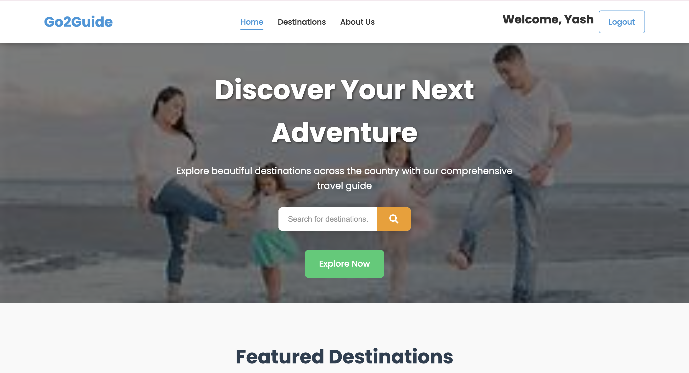
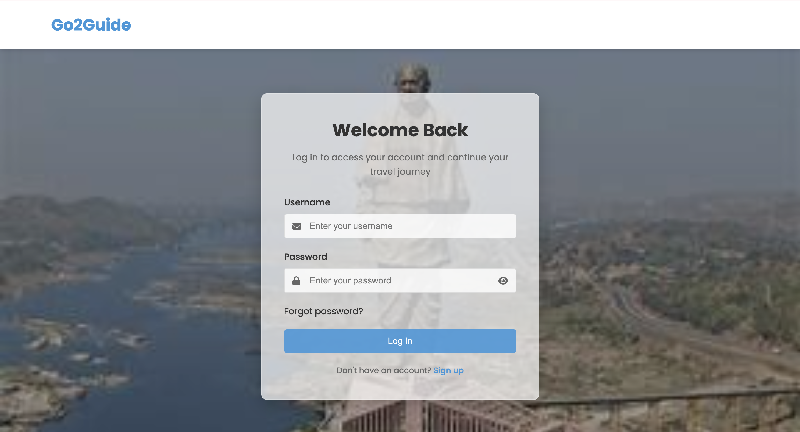
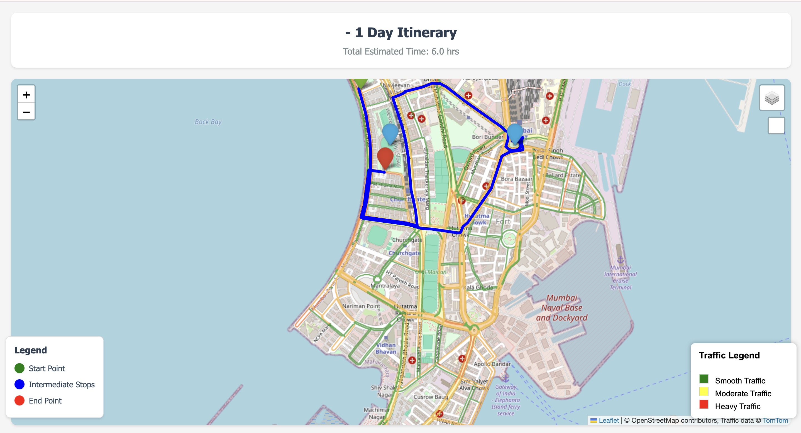
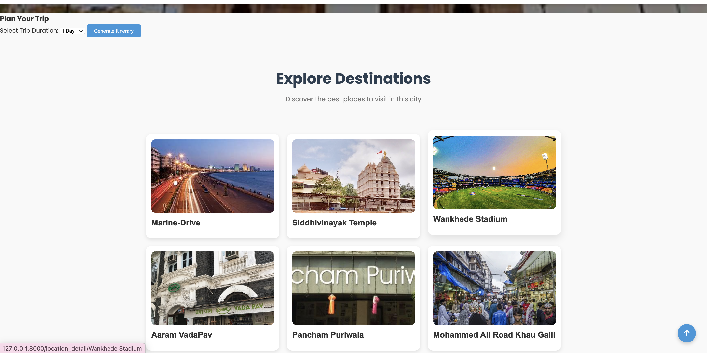

<div align="center">

<h1>
  
</h1>

<p align="center">
  <b>Your Ultimate AI-Powered Travel Companion — Explore. Plan. Discover.</b>
</p>

<p align="center">
  
  
  
  
  
  
</p>

<p align="center">
  
  
  
</p>

</div>

---

## 📸 Screenshots

<div align="center">

### 🏠 Home Page


### 🔐 Login Page


### 🗺️ City Destinations


### 📍 Interactive Itinerary Map


</div>

---

## 🌍 About Go2Guide

**Go2Guide** is a full-stack travel guide web application built with **Django** that helps users discover, explore, and plan trips to destinations across India. From iconic city landmarks to hidden gems, Go2Guide provides curated destination details, smart itinerary generation, and a real-time interactive map — all in one beautifully designed platform.

Whether you're planning a **1-day city sprint** or a **2-day deep dive**, Go2Guide generates a personalized itinerary and visualizes your route on a live map with real-time traffic overlays powered by the **TomTom API**.

---

## ✨ Features

| Feature | Description |
|---|---|
| 🔐 **User Authentication** | Register, login, email verification via OTP, and password reset |
| 🏙️ **City Explorer** | Browse cities categorized by Mountains, Beaches, Cities, Historical Sites |
| 📍 **Destination Details** | Detailed info per destination including ratings, visit duration, precautions, coordinates |
| 🗺️ **Itinerary Generator** | Auto-generate 1-day or 2-day itineraries from real destination data |
| 🧭 **Interactive Map** | Leaflet.js-powered map with color-coded markers (Start 🟢 / Stop 🔵 / End 🔴) |
| 🚦 **Live Traffic Layer** | Real-time traffic visualization using TomTom Traffic Tiles API |
| 🔍 **Destination Search** | Search bar to quickly jump to any city |
| 📂 **Category Filtering** | Browse destinations by category (Mountains, Beaches, Cities, Historical Sites) |
| 🖼️ **Rich Media** | Image uploads for cities and destinations via Django media handling |
| ✏️ **TinyMCE Editor** | Rich-text descriptions for cities and locations |
| 📧 **Email OTP Verification** | Secure account activation via Gmail SMTP |
| 📱 **Responsive Design** | Mobile-friendly layout with hamburger menu |

---

## 🗂️ Project Structure

```
Go2Guide/
│
├── 📁 pbl/                   # Django project root (settings, urls, views)
│   ├── settings.py
│   ├── urls.py               # All route definitions
│   └── views.py              # Core view logic (auth, home, itinerary)
│
├── 📁 User/                  # Custom User model (username, email, password, OTP)
│   └── models.py
│
├── 📁 city/                  # City model (name, image, category, description)
│   └── models.py
│
├── 📁 location/              # Destination model (name, city, lat/lng, rating, duration)
│   └── models.py
│
├── 📁 authentication/        # Auth helpers
│
├── 📁 templates/             # HTML templates (Jinja/Django)
│   ├── index.html            # Home page
│   ├── login.html            # Login
│   ├── signup.html           # Registration
│   ├── verify.html           # OTP verification
│   ├── forgot_password.html  # Password reset
│   ├── d.html                # All destinations (category view)
│   ├── city_detail.html      # City page with destinations grid
│   ├── location_detail.html  # Individual destination detail
│   ├── itinerary_map.html    # Interactive Leaflet map + routing
│   └── about-us.html         # Team page
│
├── 📁 static/
│   ├── css/                  # Stylesheets (styles.css, destinations.css, s.css)
│   └── js/                   # JavaScript (script.js, destinations.js)
│
├── 📁 media/                 # Uploaded images (cities, destinations, team)
├── manage.py
├── requirements.txt
└── db.sqlite3
```

---

## 🧰 Tech Stack

### Backend
- **[Django 3.2](https://www.djangoproject.com/)** — Web framework
- **SQLite** — Lightweight development database
- **Django TinyMCE** — Rich text editor for content management
- **Python 3.x** — Core language
- **Gmail SMTP** — Email OTP delivery

### Frontend
- **HTML5 / CSS3 / Vanilla JS** — Core frontend
- **[Leaflet.js](https://leafletjs.com/)** — Interactive maps
- **[Leaflet Routing Machine](https://www.liedman.net/leaflet-routing-machine/)** — Route drawing
- **[Leaflet Awesome Markers](https://github.com/sigma-geosistemas/Leaflet.awesome-markers)** — Custom map icons
- **[TomTom Traffic API](https://developer.tomtom.com/)** — Real-time traffic tiles
- **[Font Awesome](https://fontawesome.com/)** — Icons
- **[Google Fonts (Poppins)](https://fonts.google.com/specimen/Poppins)** — Typography

---

## 🚀 Getting Started

### Prerequisites

- Python 3.8+
- pip

### 1. Clone the Repository

```bash
git clone https://github.com/yourusername/Go2Guide.git
cd Go2Guide
```

### 2. Create a Virtual Environment

```bash
python -m venv venv
source venv/bin/activate        # On macOS/Linux
venv\Scripts\activate           # On Windows
```

### 3. Install Dependencies

```bash
pip install -r requirements.txt
```

### 4. Apply Migrations

```bash
python manage.py makemigrations
python manage.py migrate
```

### 5. Create a Superuser (for Admin Panel)

```bash
python manage.py createsuperuser
```

### 6. Run the Development Server

```bash
python manage.py runserver
```

Visit **[http://127.0.0.1:8000](http://127.0.0.1:8000)** in your browser.

---

## 🗺️ URL Routes

| Route | Description |
|---|---|
| `/` | Login page |
| `/register/` | Registration / Sign Up |
| `/verify/` | Email OTP verification |
| `/forgot_password/` | Password reset |
| `/home/` | Home page (featured destinations) |
| `/d/` | Browse all destinations by category |
| `/destinations/` | Full destinations listing |
| `/category_detail/<cat>` | Filter by category (e.g. Mountains, Beaches) |
| `/city_detail/<C>` | City page with destinations + itinerary planner |
| `/location_detail/<l>` | Individual destination details |
| `/generate_itinerary/` | Generate 1 or 2 day itinerary (map view) |
| `/about-us/` | Meet the team |
| `/admin/` | Django admin panel |

---

## 🧭 How the Itinerary Generator Works

1. Navigate to any **City** page
2. Select trip duration: **1 Day** or **2 Days**
3. Click **"Generate Itinerary"**
4. The system randomly selects destinations from that city:
   - **1 Day** → 4 destinations
   - **2 Days** → 7 destinations (split into two routes)
5. An interactive **Leaflet map** renders the route with:
   - 🟢 **Green** marker → Start Point
   - 🔵 **Blue** markers → Intermediate Stops
   - 🔴 **Red** marker → End Point
   - **Live Traffic Overlay** powered by TomTom API

---

## 🔐 Authentication Flow

```
Register → Email OTP sent → Verify OTP → Account Active → Login → Home
```

- Passwords stored as plain text *(not recommended for production — hashing recommended)*
- Verification code is a **6-digit OTP** sent via Gmail SMTP
- Forgot Password flow allows resetting via registered email

---

## 🗃️ Database Models

### `User`
| Field | Type | Description |
|---|---|---|
| `username` | CharField | Unique username |
| `email` | EmailField | Unique email |
| `password` | CharField | User password |
| `is_verified` | BooleanField | Email verified flag |
| `verification_code` | CharField | 6-digit OTP |

### `City`
| Field | Type | Description |
|---|---|---|
| `name` | CharField | City name |
| `image` | FileField | City banner image |
| `category` | CharField | E.g. Mountains, Beaches |
| `description` | HTMLField | Rich HTML description |

### `Destination`
| Field | Type | Description |
|---|---|---|
| `name` | CharField | Destination name |
| `city` | CharField | Parent city name |
| `description` | HTMLField | Rich HTML description |
| `image` | ImageField | Destination image |
| `location` | CharField | Address / area |
| `latitude` | FloatField | GPS latitude |
| `longitude` | FloatField | GPS longitude |
| `rating` | FloatField | User rating |
| `precautions` | TextField | Safety tips |
| `duration_hours` | FloatField | Average visit time (hrs) |

---

## 👨‍💻 Team

| Name | Role |
|---|---|
| **Yash Dharamshi** | Backend Developer |
| **Angad Kulye** | Database Developer |
| **Subroto Datta** | Frontend Designer & Project Manager |
| **Atharva Gujarathi** | Frontend Developer |

---

## 🌐 Deployment

The application is configured for deployment on **[Render](https://render.com)** (`go2guide.onrender.com` is whitelisted in `ALLOWED_HOSTS`).

> ⚠️ **Before Production Deployment:**
> - Set `DEBUG = False`
> - Move secrets (`SECRET_KEY`, email credentials) to environment variables (`.env`)
> - Use a production-grade database (PostgreSQL recommended)
> - Enable password hashing (use Django's built-in `make_password` / `check_password`)
> - Set up `whitenoise` or a CDN for static files

---

## 📦 Key Dependencies

```
Django==3.2.23
django-tinymce==4.1.0
django-leaflet==0.31.0
pillow==10.4.0
qrcode==8.0
python-dotenv==1.0.1
```

> See [`requirements.txt`](requirements.txt) for the full list.

---

## 📄 License

This project is licensed under the **MIT License**.

---

<div align="center">

Made with ❤️ by the **Go2Guide Team** — *Discover Your Next Adventure* 🌏

</div>
